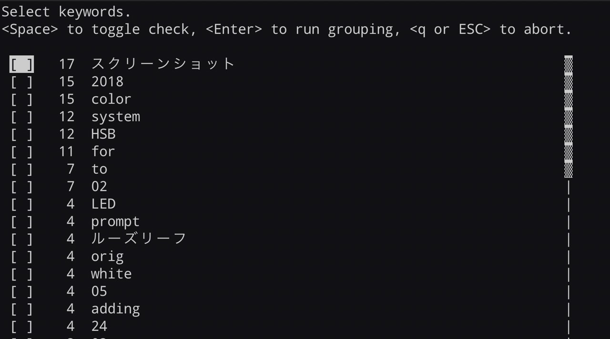

# group_files_into_dir

a CLI tool to group files into directories based on their filenames.




## Installation

Download binary file from [releases](https://github.com/craftgear/group_files_into_dirs/releases) page.

or build from source.

```bash
git clone https://github.com/craftgear/group_files_into_dirs
cargo build --release
```

## Usage

### Interactive mode

extract keywords from filenames.
delimiters are `,_- ` and braces.

- dir: directory to group files in.

```bash
group_files_into_dir <dir>
```


### specify keywords by yourself

- keywords: words to use for grouping files, comma separated.
- dir: directory to group files in.

```bash
group_files_into_dir -k <keywords> <dir> 
```

## Example

```bash
# invoke interactive mode (default)
group_files_into_dir ./

# group files in current directory based on keywords "hello" and "world"
group_files_into_dir -k "hello,world" ./
```

## LICENSE
MIT License

