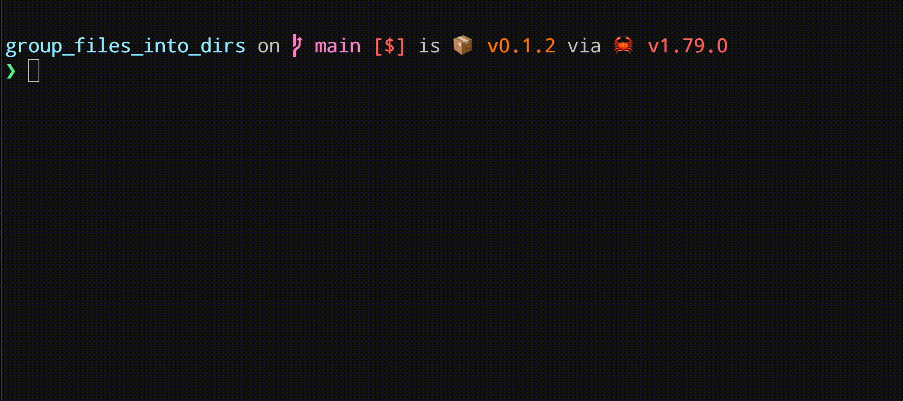

# group_files_into_dir

a CLI tool to group files into directories based on their filenames.



## Installation


Download binary file from [releases](https://github.com/craftgear/group_files_into_dirs/releases) page and put it in a path directory.

or using cargo to Install

```bash
cargo install group_files_into_dir
```

or build from source.

```bash
git clone https://github.com/craftgear/group_files_into_dirs
cargo build --release
```

## Usage

### Interactive mode (default)

extract keywords from filenames.
delimiters are `,_-`, `space` and braces `()[]{}` .

- `dir` - directory to group files in.

```bash
group_files_into_dir <dir>
```

### specify keywords by yourself

- `keywords` - words to use for grouping files, comma separated.
- `dir` - directory to group files in.

```bash
group_files_into_dir -k <keywords> <dir> 
```

## Example

```bash
# invoke interactive mode (default)
# then ask you to select keywords.
group_files_into_dir ./
```

```bash
# group files in current directory based on keywords "hello" and "world"
# no keyword selection prompt will be shown.
group_files_into_dir -k "hello,world" ./
```

## LICENSE
MIT License

