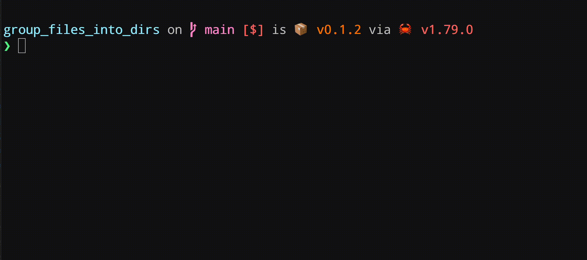

# group_files_into_dir

a CLI tool to group files into directories based on their filenames.



## Installation

Download binary file from [releases](https://github.com/craftgear/group_files_into_dirs/releases) page and put it in a path directory.

or using cargo to Install

```bash
cargo install group_files_into_dir
```

or build from source.

```bash
git clone https://github.com/craftgear/group_files_into_dirs
cargo build --release
```

## Usage

### 1. Interactive mode (default)

Extract keywords from filenames and show them as a list of checkboxes for you to choose them.

Default delimiters are `,_-` and braces `()[]{}` .

If you want to use `spaces` as delimiters as well, then add `-s` option.

- `dir` - directory to group files in.

```bash
group_files_into_dir <dir>
```

### 2. specify keywords by yourself

- `keywords` - words to use for grouping files, comma separated.
- `dir` - directory to group files in.

```bash
group_files_into_dir -k <keywords> <dir> 
```

### 3. use directory names as keywords
Once you've created directories with interactive mode or specific keywords mode, 
this mode would be your daily driver.

With `-d` option, you can group files into directories based on directory names.

Let's say you have `inquiry` directory and `quote` directory in `docs` directory. 
Now when you put `inquiry_2021-01-01.txt` and `quote_2021-01-01.txt` in `docs` directory,
you can move them into `inquiry` and `quote` directories with this mode.

- `dir` - directory to group files in.

```bash
group_files_into_dir -d <dir> 
```


## Example

```bash
# invoke interactive mode (default)
# then ask you to select keywords.
group_files_into_dir ./
```

```bash
# group files in current directory based on keywords "hello" and "world"
# no keyword selection prompt will be shown.
group_files_into_dir -k "hello,world" ./
```

```bash
# now you can occasionally organize files with -d option.
group_files_into_dir -d ./
```

## LICENSE
MIT License

